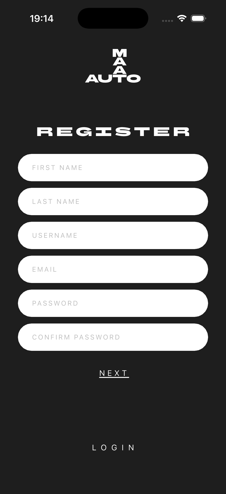
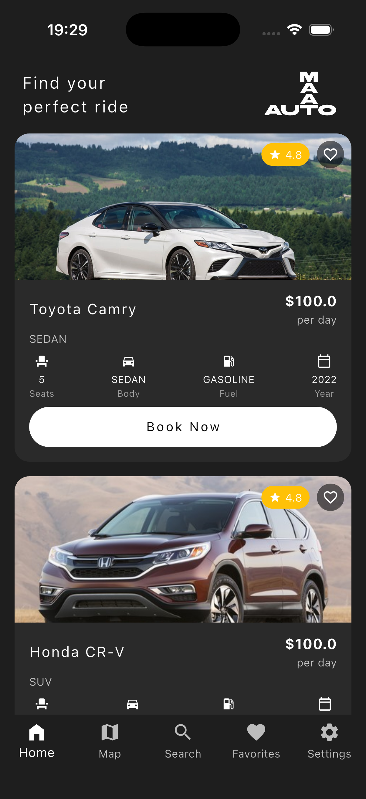
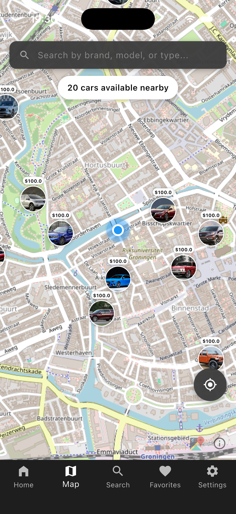
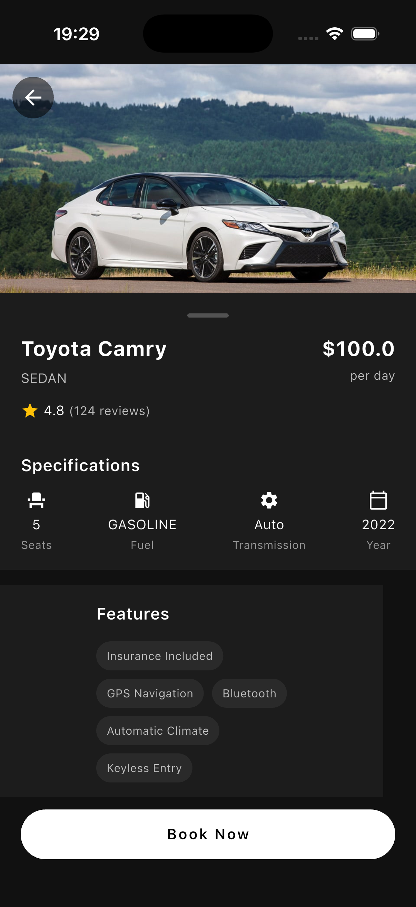
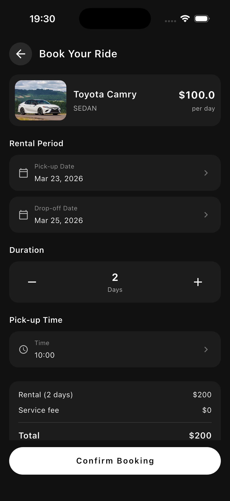

# AutoMaat 🚗

AutoMaat is a modern and fully-featured Flutter application built for car sharing, booking, and navigation.

Designed with a stunning dark-themed interface, the app allows users to easily find, book, and navigate to rental cars while providing tools for managing profiles, payments, and reporting vehicle conditions.

## 📱 Screenshots

| Splash | Register | Home |
|:---:|:---:|:---:|
|  |  |  |

| Map | Car Details | Booking |
|:---:|:---:|:---:|
|  |  |  |

## ✨ Features

- **User Authentication:** Secure Login, Registration, Password Reset, and Profile Management handled via the backend API.
- **Interactive Maps & Navigation:** Built with `flutter_map` and OpenStreetMap to find nearby cars, alongside `geolocator` and `latlong2` for real-time tracking and caching tiles for offline use.
- **Car Booking & Rentals:** Browse available vehicles, view detailed specifications, manage favorite cars, and track active or past rentals.
- **Secure Payments:** A dedicated flow for handling rental payments seamlessly.
- **Custom Theming:** A beautiful dark theme layout using custom typography (BHH Sans Bartleby) and SVGs.

## 🛠️ Technology Stack

- **Framework:** Flutter (SDK ^3.10.1)
- **Backend Service:** This application relies on a separate backend repository for its core API services.
- **Maps:** `flutter_map`, `flutter_map_tile_caching`, OpenStreetMap
- **State/Storage:** `shared_preferences`, `flutter_dotenv`
- **Networking/APIs:** `http`
- **Location:** `geolocator`, `latlong2`

## ⚙️ Backend Setup

This Flutter application acts as the client for a separate Java Spring Boot backend (built with JHipster). To use the full feature set—including user registration and emails—you will need to run the backend and its development email server.

### 1. Clone & Run the Backend

```bash
git clone https://github.com/hanze-hbo-ict/mad-server-generated.git
cd mad-server-generated
```

**To start the server:**
- **Windows:** `mvnw.cmd`
- **Linux/Mac:** `./mvnw`

Once the server finishes booting, the REST API runs at `http://localhost:8080/`.
You can find the Swagger OpenAPI documentation at `http://localhost:8080/admin/docs` (Login with `admin` / `admin`).

*(Note: The backend defaults to an H2 in-memory database with pre-seeded test data. Any changes you make will reset on restart unless you change line 40/41 in `src/main/resources/config/application-dev.yml` to persist data.)*

### 2. Run the Email Server

The backend uses a Dockerized MailDev server to catch outgoing emails like registrations or password recovery. Open a new terminal inside the backend directory and start it:

```bash
docker compose -f src/main/docker/maildev.yml up
```

You can view all dispatched emails via the MailDev web interface at [http://localhost:1080/](http://localhost:1080/).

## 🚀 Frontend Setup

> **Note:** This project is the frontend client. To run the complete application, ensure you have the associated backend repository set up and running locally or pointed to a valid staging/production environment via the `.env` file.

To get started with the AutoMaat app locally, follow these steps:

### Prerequisites

- [Flutter SDK](https://docs.flutter.dev/get-started/install) installed on your machine.
- A `.env` file for your API keys (create this in the root directory and add it to `assets` in `pubspec.yaml`).

### Installation

1. **Clone the repository:**
   ```bash
   git clone <your-repository-url>
   cd automaat
   ```

2. **Install dependencies:**
   ```bash
   flutter pub get
   ```

3. **Environment Variables:**
   Create a `.env` file in the root directory if it does not exist already and populate it with required variables:
   ```env
   # Example
   API_KEY=your_api_key_here
   ```

4. **Run the App:**
   ```bash
   flutter run
   ```

## 🏗️ Project Structure

The UI uses a component-driven approach. Key directories under `lib/` include:
- `pages/`: Contains all main application screens (Home, Login, Map, Booking, etc.)
- `widgets/`: Reusable, custom UI components tailored to the app's aesthetic.
- `theme/`: Defines `AppTheme`, specifically curating the sleek dark interface.
- `services/`: Encapsulates business logic, API calls, and external integrations.

---

Built with 💙 and Flutter.
